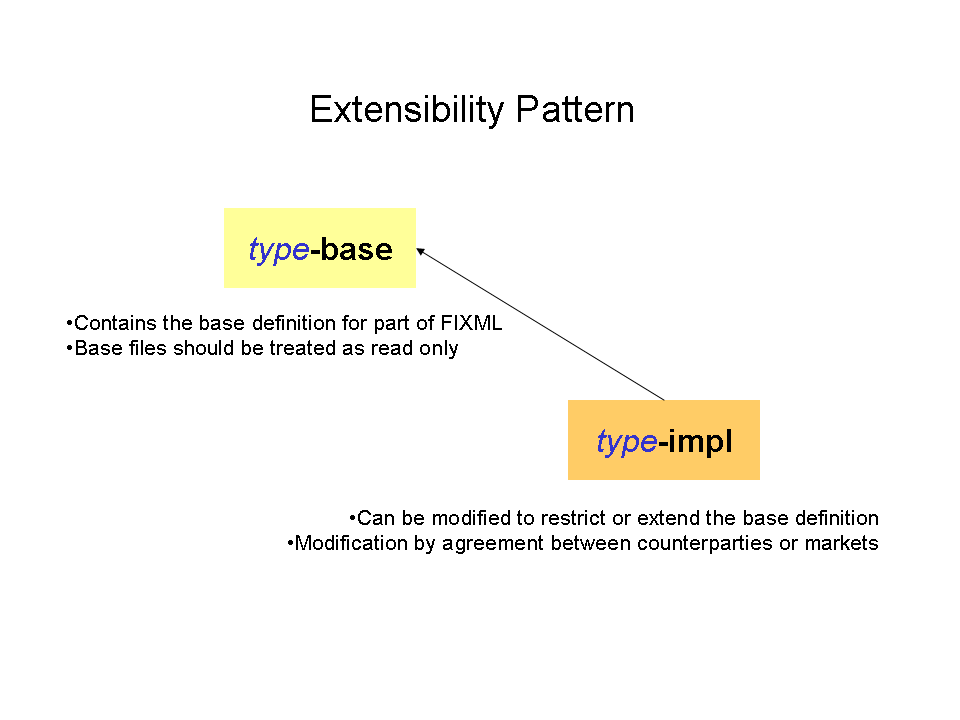
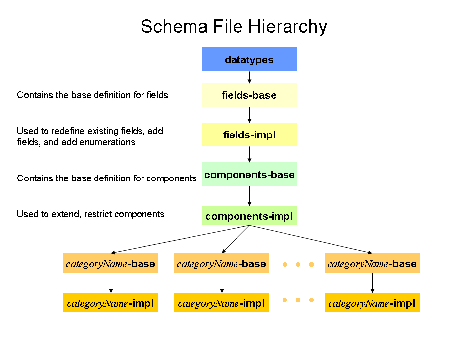
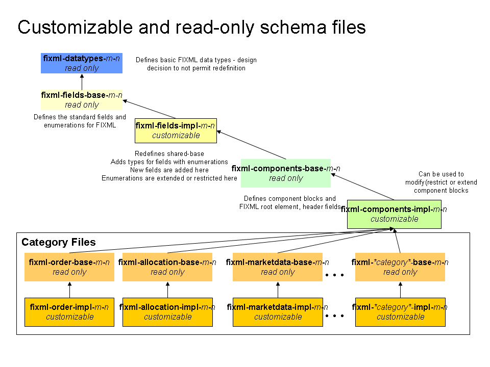

FIXML Schema Implementation
===========================

Organization of files is driven largely by the requirement to support customization of the FIXML Schema. The basic organization of the schema has the datatypes used by the fields maintained in a separate file. FIX fields are defined in the shared file. Components and the FIXML root element are defined in the component files. FIXML messages are defined within separate category files. Convenience files include the category files and the main file includes the convenience files. The figure below illustrates the relationship of these file types.

Figure 1 - FIXML Schema Layers

 Extensibility Design Pattern
-----------------------------

An extensibility design pattern is implemented in the FIXML schema that defines how the FIXML definition is partitioned and organized within separate schema files in order to provide a uniform method to support customization.

The figure below illustrates the relationship between the base and implementation files and the general extensibility design pattern.

Figure 2 - FIXML Schema Extension Implementation

Each level of schema file (with the exception of datatypes and convenience files) includes a base definition file that defines the standard (default) FIXML language. Each level also includes an implementation (impl) file that references the base definition.

The figure below illustrates how the design pattern is applied to the various layers of schema files.

Figure 3 - FIXML Schema File Hierarchy

In general, base schema files are intended to be read only and include the FIX standard and implementation files are used to support customization of the base file content.

The figure below illustrates the read only and customizable files within the FIXML schema hierarchy.

Figure 4 - Customizable and Read Only FIXML Schema Files

FIXML Schema file naming conventions
---------------------------------------------------------------------------------------------------------------------------------

As described above, the FIXML schema includes several files. The file naming convention is as follows:

fixml-Type-{base|impl}-**Version**.xsd

Type is one of:

> category - where category is one of the FIX message categories.
>
> components
>
> datatypes
>
> fields
>
> main
>
> metadata

Version is the FIX application level version (e.g. 5-0-SP2)

**Examples**

> fixml-components-base-5-0-SP2.xml
>
> fixml-components-impl-5-0-SP2.xml
>
> fixml-datatypes-5-0-SP2.xml
>
> fixml-main-5-0-SP2.xml
>
> fixml-metadata-5-0-SP2.xml
>
> fixml-order-base-5-0-SP2.xml
>
> fixml-order-impl-5-0-SP2.xml

The type of the schema file is identified in the second component of the file name. The datatypes file contains the basic datatypes used within FIXML. The shared files contain the definitions for FIX fields. The components file contains definitions for FIXML components, additional components identified while defining the FIXML schema, and the outer elements for FIX.

Several FIXML schema files are either a base file or an implementation (impl). Base files define the standard FIXML language. Impl files are used to extend or restrict the base FIXML language.

Refer to the FIXML Schema File Summary section for a complete list of schema files used in FIXML.

FIXML Versioning
----------------

&lt;&lt; add section here to cover the XML Schema for FIX Standards content&gt;&gt;
